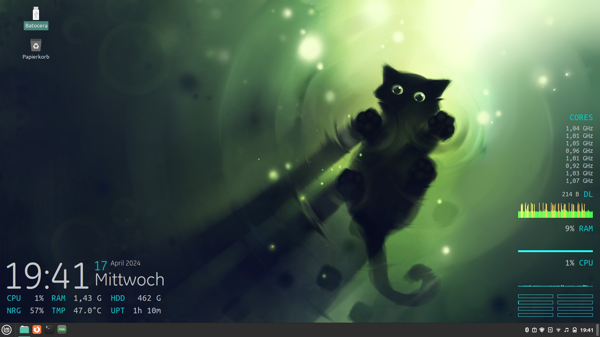
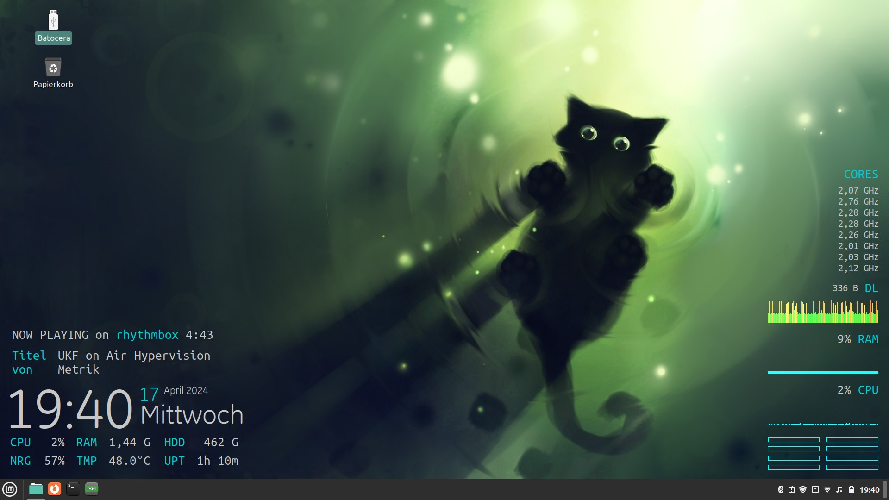
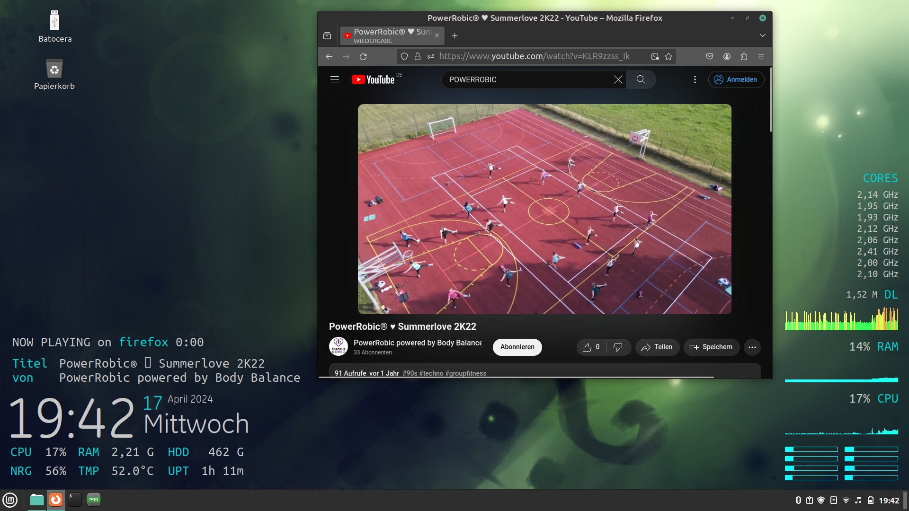

# conky Gotham reloaded theme

Pimped Gotham theme with Media Player support (uses playerctl).

## Setup

- install "playerctl" (on ubuntu: sudo apt install playerctl)
- copy "conkystart.sh" and the "conky" dir to your home folder
- execute "conkystart.sh" 

## Preview Images

